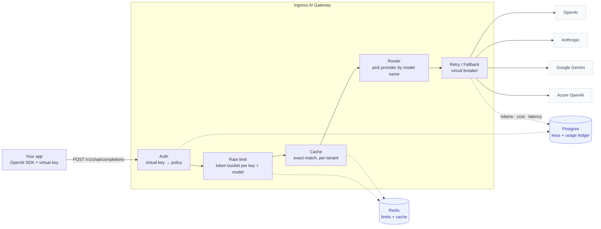
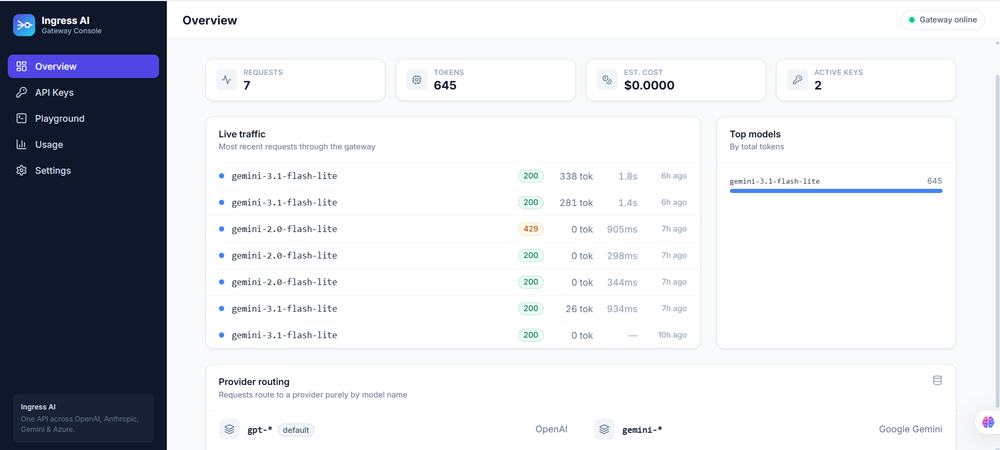
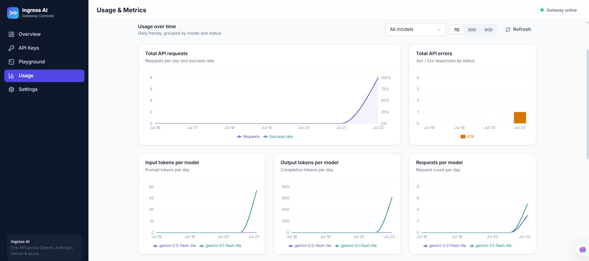
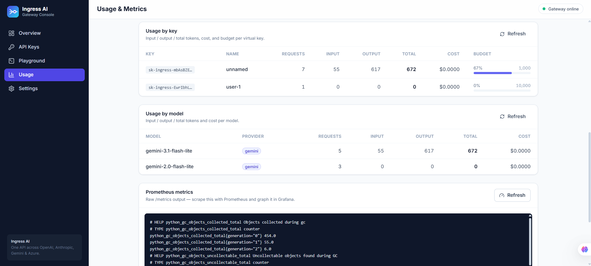
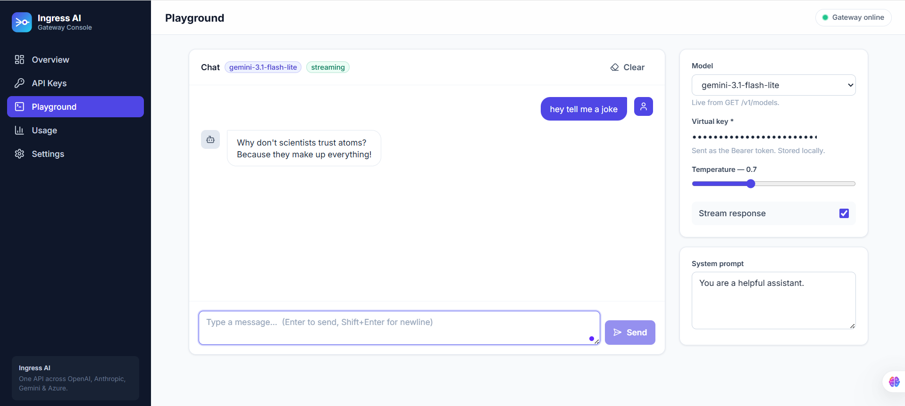
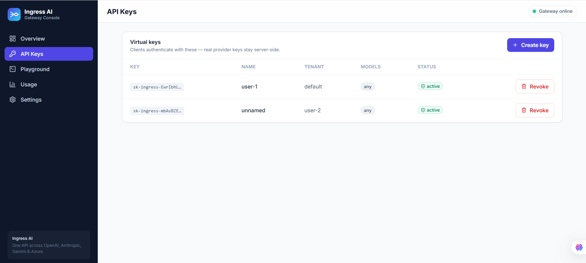
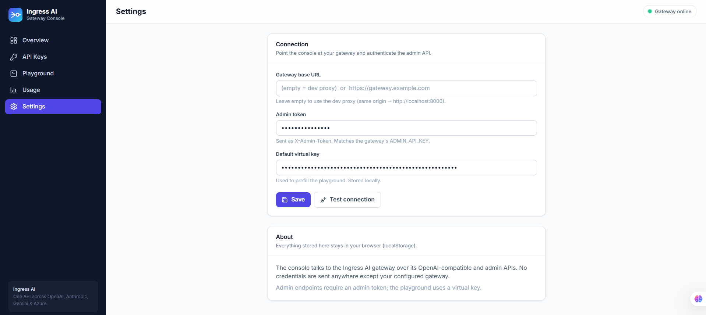

# Ingress AI

**One OpenAI-compatible API in front of every LLM provider.** Point your app at
Ingress AI instead of calling OpenAI / Anthropic / Gemini / Azure directly, and
get unified access, per-app keys, rate limits, automatic fail-over, caching, and a
full usage/cost ledger — without changing your client code.

## What it does

Using several LLM providers usually means juggling four SDKs, four sets of API
keys scattered across your services, no shared rate limiting or cost tracking, and
no failover when a provider has a bad day. Ingress AI puts one gateway in front of
all of them:

- Your apps speak the **OpenAI API** they already use — only the base URL changes.
- You pick a provider **by model name** (`gpt-*`, `claude-*`, `gemini-*`,
  `azure/*`); the gateway translates to each provider's native format and back.
- Real provider keys stay **server-side**; your apps carry scoped **virtual keys**.
- Every request is rate-limited, optionally cached, retried / failed-over on error,
  and written to a **tokens + cost ledger** you can break down per key.



## Features

- **Unified API** — OpenAI-compatible `/v1/chat/completions` and `/v1/embeddings`, streaming and non-streaming.
- **Many providers, one interface** — OpenAI, Anthropic, Azure OpenAI, Google Gemini, plus OpenAI-compatible endpoints (Groq, Together, DeepSeek, OpenRouter, Ollama), routed by model.
- **Virtual keys** — hashed, per-key allowed models, admin-managed; provider keys never leave the server.
- **Per-key governance** — request/min and token/min limits, concurrency caps, token & cost budgets (daily/monthly), and key expiry.
- **Model registry** — DB-backed pricing, aliases, enable/disable, and default limits (overrides the env model list).
- **Resilience** — retry with backoff, fail-over to fallback models, per-provider circuit breaker.
- **Caching** — exact-match response cache, per-tenant (`X-Cache: HIT/MISS`).
- **Observability** — usage/cost ledger (queryable per key), Prometheus `/metrics`, trace IDs, optional redacted audit capture.
- **Audit & conversation grouping** — opt-in capture of prompt/response pairs, grouped into conversations via an optional `X-Conversation-ID` header, with the virtual key used shown per conversation.
- **MCP gateway** (opt-in) — one governed MCP endpoint (`POST /mcp`) fronting many upstream MCP servers: tools aggregated and namespaced, scoped per virtual key, and written to the same usage ledger.
- **Guardrails** — request-size limits, `max_tokens` caps, and opt-in prompt-injection screening.
- **Dashboard** — a React console (`client/`) for keys, a model registry, a chat playground, usage/metrics, and audit logs.

## Screenshots

<table>
  <tr>
    <td width="50%" valign="top" align="center">
      <br><br>
      <b>Overview</b><br>Live traffic feed, top models, and provider routing.
    </td>
    <td width="50%" valign="top" align="center">
      <br><br>
      <b>Usage — trends</b><br>Daily requests, errors, and tokens per model.
    </td>
  </tr>
  <tr><td colspan="2"><br></td></tr>
  <tr>
    <td width="50%" valign="top" align="center">
      <br><br>
      <b>Usage — per key</b><br>Token/cost breakdown and budgets per virtual key.
    </td>
    <td width="50%" valign="top" align="center">
      <br><br>
      <b>Playground</b><br>Streaming chat against any model, with Markdown output.
    </td>
  </tr>
</table>

<br>

<table>
  <tr>
    <td width="50%" valign="top" align="center">
      <br><br>
      <b>API keys</b><br>Create, list, and revoke virtual keys.
    </td>
    <td width="50%" valign="top" align="center">
      <br><br>
      <b>Settings</b><br>Connect the console to your gateway URL and tokens.
    </td>
  </tr>
</table>

## Dashboard

A web console lives in [`client/`](client/) (React + Vite + Tailwind): create and
revoke keys, manage the model registry, watch per-key token/cost usage, read live
metrics, browse grouped audit logs, and test any model in a streaming chat
playground. Setup in [client/README.md](client/README.md).

It's built to stay small and readable while being production-shaped: shared
connection pools, streaming without buffering, and state kept in Redis + Postgres
so any replica can serve any request.

## Project layout

- `app/main.py` — FastAPI app, lifespan (shared HTTP client), route wiring
- `app/api/` — API endpoints for chat and admin
- `app/core/` — config, auth, rate limits, cache, and error handling
- `app/router/` — provider selection and health / circuit-breaker state
- `app/providers/` — adapter contract plus provider-specific translators
- `app/resilience/` — retry and fallback logic
- `app/schemas/` — unified request/response models and usage records
- `app/observability/` — logging, usage persistence, and metrics
- `app/db/` — Postgres models and async session setup

## Requirements

- Python 3.12+
- [uv](https://docs.astral.sh/uv/) for dependency management

## Quickstart

```bash
# 1. Install dependencies into a local virtualenv
uv sync

# 2. Configure your OpenAI key
cp .env.example .env      # then edit .env and set OPENAI_API_KEY

# 3. Run the gateway
uv run uvicorn app.main:app --reload
```

Then call it exactly like the OpenAI API, pointing at the gateway's base URL:

```bash
curl http://localhost:8000/v1/chat/completions \
  -H "Content-Type: application/json" \
  -d '{
    "model": "gpt-4o-mini",
    "messages": [{"role": "user", "content": "Hello!"}]
  }'
```

Streaming works the same way — add `"stream": true` and the gateway relays the
server-sent events straight through without buffering.

## Virtual keys

Clients authenticate with a **virtual key** (`sk-ingress-…`) instead of a real
provider key — the provider keys stay server-side in config. Keys are stored
hashed (only a prefix is retained for display) and can be scoped to a set of
allowed models.

Set `ADMIN_API_KEY` in `.env`, then mint a key:

```bash
curl http://localhost:8000/admin/keys \
  -H "X-Admin-Token: $ADMIN_API_KEY" \
  -H "Content-Type: application/json" \
  -d '{"name": "my-app", "allowed_models": ["gpt-4o-mini", "claude-3-5-sonnet"]}'
# -> {"id": 1, "key": "sk-ingress-...", ...}   (the full key is shown only once)
```

Use it as the bearer token on chat requests:

```bash
curl http://localhost:8000/v1/chat/completions \
  -H "Authorization: Bearer sk-ingress-..." \
  -H "Content-Type: application/json" \
  -d '{"model": "gpt-4o-mini", "messages": [{"role": "user", "content": "Hello!"}]}'
```

## Tests

```bash
uv run pytest
```

## Usage & metrics

Every request writes a usage record (tokens, estimated cost, latency, provider,
status, cache hit) off the hot path. `GET /admin/usage` returns totals,
`GET /admin/usage/by-key` breaks it down per key, and
`GET /metrics` exposes Prometheus counters/histograms.

Add a `fallbacks` list to any request and the gateway retries transient failures,
then fails over to the next model (possibly a different provider) if the primary
stays down:

```json
{
  "model": "gpt-4o-mini",
  "messages": [{"role": "user", "content": "Hello!"}],
  "fallbacks": ["claude-3-5-sonnet", "gemini-1.5-flash"]
}
```

Point any OpenAI SDK at the gateway and choose a provider purely by model name —
same request shape for all of them:

| Model prefix | Provider |
|---|---|
| `gpt-*` (default) | OpenAI |
| `gemini-*` | Google Gemini |
| `claude-*` | Anthropic |
| `azure/<deployment>` | Azure OpenAI |

### OpenAI-compatible providers

**Groq, Together, DeepSeek, OpenRouter, and Ollama** speak the exact OpenAI
Chat Completions format, so they need no new adapter — only a base URL + key.
Because their model names aren't prefixable (`llama-3.1-70b`, `deepseek-chat`),
routing comes from the **model registry's provider**, not the name. To use one:

1. Set its key (e.g. `GROQ_API_KEY`) — or add a credential on the **Providers** page.
2. Register the model on the **Models** page with the matching provider (`groq`,
   `together`, `deepseek`, `openrouter`, `ollama`).

That's it — clients then call the model by name like any other. Base URLs default
to each provider's public endpoint and are overridable (`GROQ_BASE_URL`, …).
Adding another OpenAI-compatible provider is a one-line entry in the registry.

## MCP Gateway

The gateway can also front **MCP servers**, not just LLM providers — one governed
MCP endpoint over many upstream servers, reusing the same virtual keys, scoping,
and usage ledger. The principle: the gateway is an **MCP server to your clients**
and an **MCP client to the upstream servers**. Every LLM-gateway pillar maps 1:1.

| LLM gateway | MCP gateway |
|---|---|
| OpenAI API → many providers | `POST /mcp` → many MCP servers |
| Route by model name | Route by server namespace (`github__create_issue`) |
| `allowed_models` per key | `allowed_servers` / `allowed_tools` per key |
| Model registry | MCP server registry (`/admin/mcp/servers`) |
| Usage ledger (tokens/cost) | Tool-call ledger (calls/latency, one ledger via `kind`) |

Enable it and register an upstream:

```bash
# 1. Turn it on (off by default)
MCP_ENABLED=true

# 2. Register an upstream MCP server (remote Streamable HTTP)
curl http://localhost:8000/admin/mcp/servers \
  -H "X-Admin-Token: $ADMIN_API_KEY" -H "Content-Type: application/json" \
  -d '{"name": "github", "url": "https://mcp.example.com/mcp",
       "auth_header": "Authorization", "auth_value": "Bearer <upstream-token>"}'
```

Point any MCP client (Cursor, Claude Desktop, your app) at `POST /mcp` with a
virtual key as the bearer token. `tools/list` fans out to every server the key is
allowed to use and returns their tools namespaced `{server}__{tool}`; a
`tools/call` is demuxed back to its server, scope-checked, forwarded, and
recorded. Upstream credentials stay server-side (encrypted at rest, never
returned) exactly like provider keys.

v1 fronts remote **Streamable HTTP** upstreams and the `initialize` / `tools/list`
/ `tools/call` surface; `resources/*`, `prompts/*`, and stdio servers are on the
roadmap (see [plan/MCP-Gateway-Build-Plan.md](plan/MCP-Gateway-Build-Plan.md)).

## Admin endpoints

All require the `X-Admin-Token` header (set `ADMIN_API_KEY`).

| Method | Path | Purpose |
|---|---|---|
| `POST` | `/admin/keys` | Create a virtual key (full key returned once) |
| `GET` | `/admin/keys` | List keys (prefix + metadata only) |
| `PATCH` | `/admin/keys/{id}` | Edit a key (name, models, limits, budgets, expiry) |
| `DELETE` | `/admin/keys/{id}` | Revoke a key (deactivates, keeps usage history) |
| `GET` | `/admin/usage` | Usage totals (requests, tokens, cost); `?days=N` to window |
| `GET/POST/PATCH/DELETE` | `/admin/models` | Model registry (pricing, aliases, enable/disable, default limits) |
| `GET/POST/PATCH/DELETE` | `/admin/mcp/servers` | MCP server registry (upstream auth redacted; when MCP is enabled) |
| `GET` | `/admin/audit` | Captured prompt/response turns, grouped into conversations (when audit is enabled) |

Reads accept any admin token (including `ADMIN_READ_TOKENS`); create/edit/delete
require a full-admin token (`ADMIN_API_KEY` or `ADMIN_TOKENS`).

Per-key controls (set on create or `PATCH`): `rate_limit_per_minute`, `tpm_limit`
(tokens/min), `max_concurrency`, `token_budget` / `cost_budget_usd` with a
`budget_period` of `total`/`daily`/`monthly`, and `expires_at`.

## Audit & conversation grouping

Set `AUDIT_CAPTURE_CONTENT=true` to record each request's prompt and response
(redacted, off the hot path) into an audit log. Turns are grouped into a single
conversation when the client sends an optional **`X-Conversation-ID`** header —
otherwise each request stands alone. `/admin/audit` returns one entry per
conversation with its turn count and the virtual key used; the dashboard's Audit
page shows each turn as a request/response pair.

The gateway is stateless and never caps conversation length. The playground reads
`MAX_CONVERSATION_TURNS` (default 5) from the public `GET /v1/config` endpoint and
enforces the limit client-side — prompting the user to start a new chat (with a
fresh conversation id) once it's reached.

## Deploy

The gateway is stateless — all state lives in Postgres and Redis — so it scales
horizontally behind a load balancer. `docker-compose` brings up the gateway with
both, wired to the Redis rate-limit/cache backends:

```bash
export ADMIN_API_KEY=your-admin-token
export OPENAI_API_KEY=sk-...        # and any other provider keys you use
docker compose up --build
```

`/health` is a readiness probe and `/metrics` is Prometheus-scrapeable.
